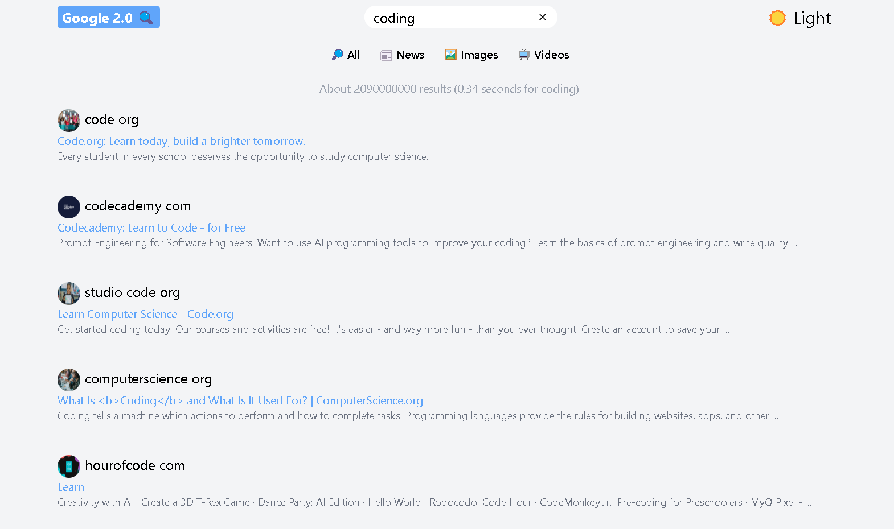

# Google 2.0

  

# Technologies Used

 

 
  
  
 

# My Learning

- context api
- creating a custom hook

### Continued development

    # Google Search
        Sections - 1. Search - fetch and show responses
        2. News
        3. Images
        4. Videos
        5. AI
       
      pagination 
      footer
      theme - Dark and light mode switch in tailwindcss

# My Progress

- navbar

## Acknowledgments

### [JS Mastery](https://youtu.be/I1cpb0tYV74?si=F4XPeY96fOiy3FR9)

# Feedback for me

# Useful Resources

# Course

## For Developers

    ## The challenge
    ## Clone Repo
    ## Assets
    ## Figma file
    ## Share your project with me
    ## Need Help from me

**Have fun Coding 🚀**
