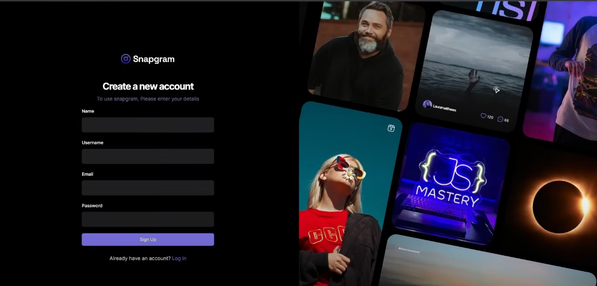

# Welcome! To 👋 Instagram 2.0

  
  

  

    
    
    
    
    
  

# My Learning

- Making layout using react-router-dom

### Continued development

## Acknowledgments

- [JavaScript Mastery]('https://youtu.be/_W3R2VwRyF4?si=4WSsg16rxEsbIUV-')

# My Progress

# Feedback for me

# Useful Resources

# Course

## For Developers

    ## The challenge
    ## Clone Repo
    ## Assets
    ## Figma file
    ## Share your project with me
    ## Need Help from me

**Have fun Coding 🚀**
