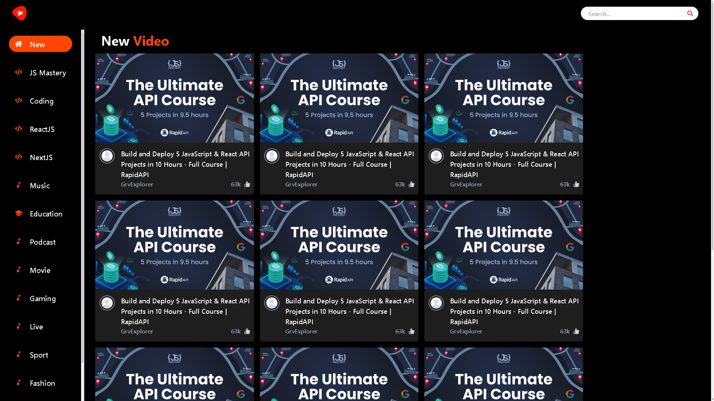
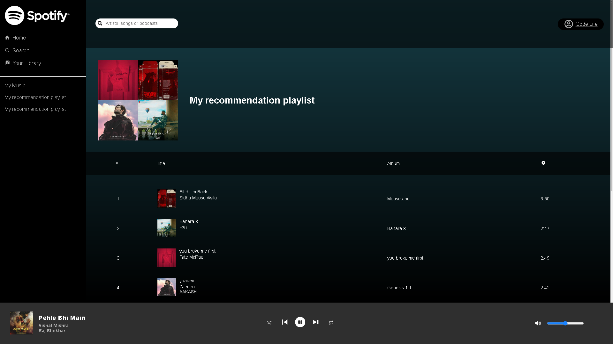
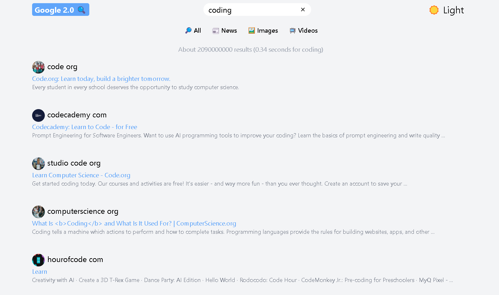

# 5 Hard Project
    Give it a ⭐ if you like this project.

### 1. YouTube 2.0

  

Basic Stage Completed Add Features Later On ( refactor )

### 2. Spotify 2.0

  

Basic Stage Completed Add Features Later On ( refactor)

### 3. Google 2.0

  

Basic Stage Completed Add Features Later On ( refactor)

### 4. Instagram 2.0

    working on this starting date: 28/01/2024

### 5. Crypto 2.0