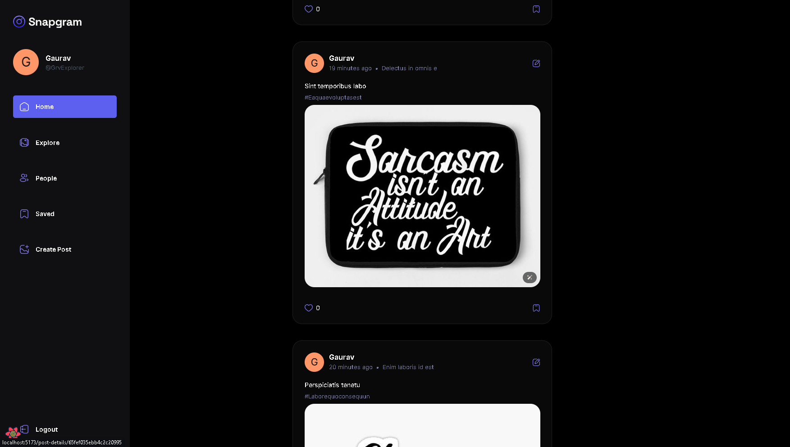

# 5 Hard Project
    Give it a ⭐ if you like these project.

### 1. YouTube 2.0

  

Basic Stage Completed Add Features Later On ( refactor )

### 2. Spotify 2.0

  

Basic Stage Completed Add Features Later On ( refactor)

### 3. Google 2.0

  

Basic Stage Completed Add Features Later On ( refactor)

### 4. Instagram 2.0

  

Basic Stage Completed Add Features Later On (refactor)

### 5. Admin Dashboard
    Starts At 26/04/2024
