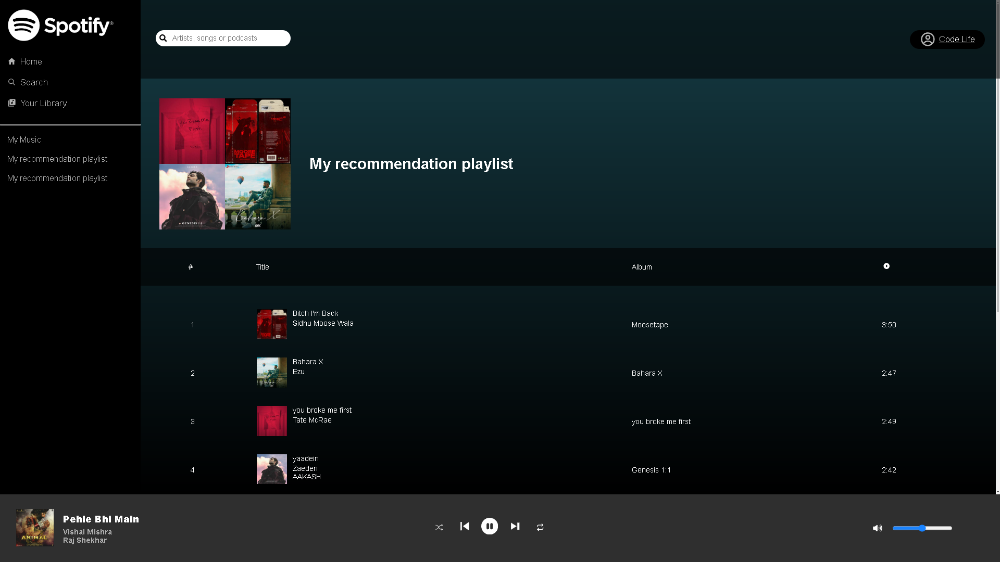

# Spotify 2.0

This Project uses Spotify API to get the json format of music details. It uses your own spotify account as to play using music using Spotify API. You can trust this application it dose not use your spotify account to other then playing music.

    Give it a ⭐ if you like this project.

  

# Technologies used
   
  

  
 

# My Learning
  Context API
  styled-components
  axios
  spotify API 
  ( premium required on play/pause/next/previous/shuffle/repeat/volume )

### Continued development
     
        Body ( Search ) 

# My Progress

Login Page,
get the token,
Feed layout,
Sidebar ( playlist displays of user),
Navbar,
Body ( Song displays of user &&  && playlist's ),
footer ( play/pause/next/previous/shuffle/repeat ),
footer ( volume ), 
changePlaylist, 
changeTrack, 

## Acknowledgments
  ### [Kishan Sheth](https://youtu.be/ajVcLGEw8Xw?si=h4Cy3M5a0ZlDbhP7), [JS Mastery](https://youtu.be/I1cpb0tYV74?si=F4XPeY96fOiy3FR9)

# Feedback for me

# Useful Resources

# Course

## For Developers

    ## The challenge
    ## Clone Repo
    ## Assets
    ## Figma file
    ## Share your project with me
    ## Need Help from me

**Have fun Coding 🚀**
